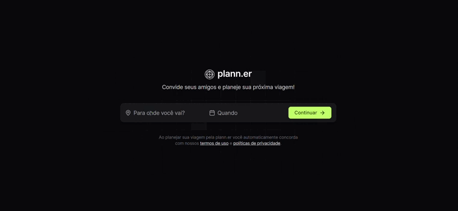

<h1 align="center">
  <a href="https://github.com/csorlandi/nodejs-concepts">
    
  </a>
</h1>

<p align="center">
  <a href="#execution">Preview</a>&nbsp;&nbsp;&nbsp;|&nbsp;&nbsp;&nbsp;
  <a href="#technologies">Technologies Used</a>&nbsp;&nbsp;&nbsp;|&nbsp;&nbsp;&nbsp;
  <a href="#run">How to run the project</a>&nbsp;&nbsp;&nbsp;|&nbsp;&nbsp;&nbsp;
  <a href="#contribute">How to contribute</a>&nbsp;&nbsp;&nbsp;|&nbsp;&nbsp;&nbsp;
  <a href="#license">License</a>
</p>

<p align="center">
 

  

  
</p>

<br>

## :books: About

Plann.er is a travel organizer where you can:

- Choose the start and end date of the trip;
- Invite friends to share the trip;
- Define the activities that will be carried out on the days of the trip;
- Add important links for the trip.

<a id="execution"></a><br>

## :tv: Preview



<br>

<a id="technologies"></a><br>

## ⚒️ Technologies Used

- Vite
- Axios
- React.js
- Tailwind
- Date-fns
- TypeScript

<a id="run"></a><br>

## 🚀 How to run the project

<br>

- Clone this repository

  ```
  git clone https://github.com/RuthMaria/planner.git
  ```

- Create the ".env" file equal to the ".env.example" model, replace the ports according to those of your frontend.
  <br>

- Run backend

  - Enter the backend folder

  ```
  cd backend
  ```

  - Install dependencies

  ```
  npm install
  ```

  - Run the project

  ```
  npm run dev
  ```

  <br>

- Run frontend

  - Enter the frontend folder

  ```
  cd frontend
  ```

  - Install dependencies

  ```
  npm install
  ```

  - Run the project

  ```
  npm run dev
  ```

  <br>

## 🎯 How to contribute

- Fork this repository,
- Create a branch with your feature: `git checkout -b my-feature`
- Commit your changes: `git commit -m 'feat: My new feature'`
- Push your branch: `git push origin my-feature`

<a id="license"></a><br>

## :memo: License

This project is under the MIT license. See the file [LICENSE](LICENSE) for more details.

---

<h4 align="center">
    Developed with ❤️ by <a href="https://www.linkedin.com/in/ruth-maria-9b256071/" target="_blank">Ruth Maria</a>
</h4>
